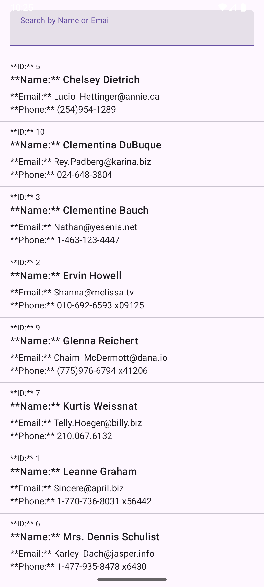

# Offine User Directory

The User Directory is an offline-first application designed to retrieve and display a list of user profiles from a public API. The application fetches data upon launch, caches it locally, and displays the cached results instantly, guaranteeing data persistence and stability.

### Implementation Description

The app fetches fresh data from a Retrofit API call and stores it to a local Room Database. The UI always reads from the database's Flow, which automatically updates the view whenever the background caching job completes.

The local search functionality is implemented by using a custom SQL query within the Room DAO, filtering directly on the cached data without making any network requests.

## Screenshots

### App view

### Search function

